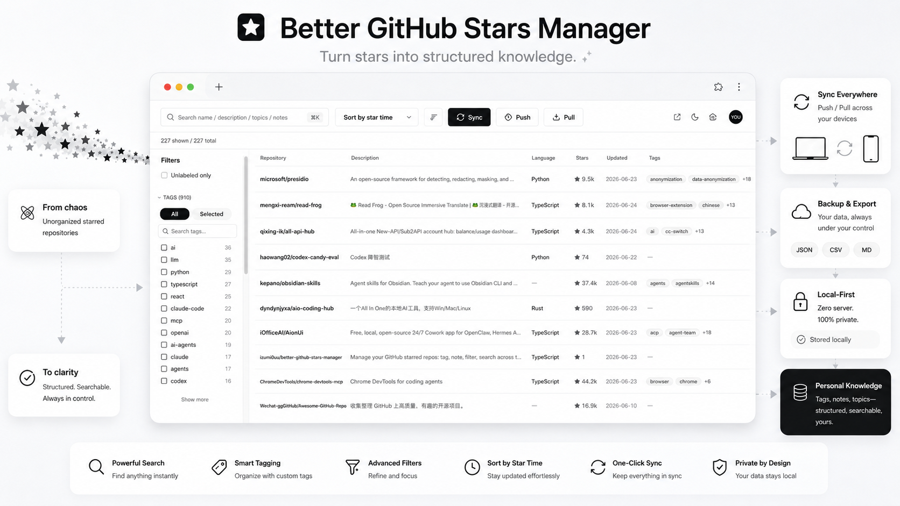
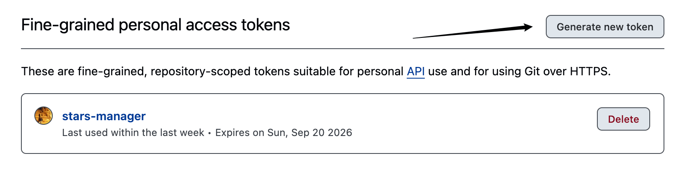
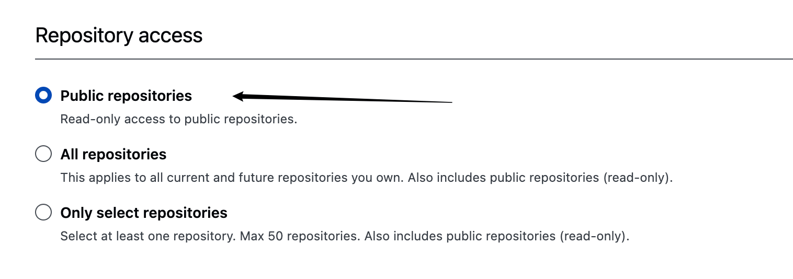
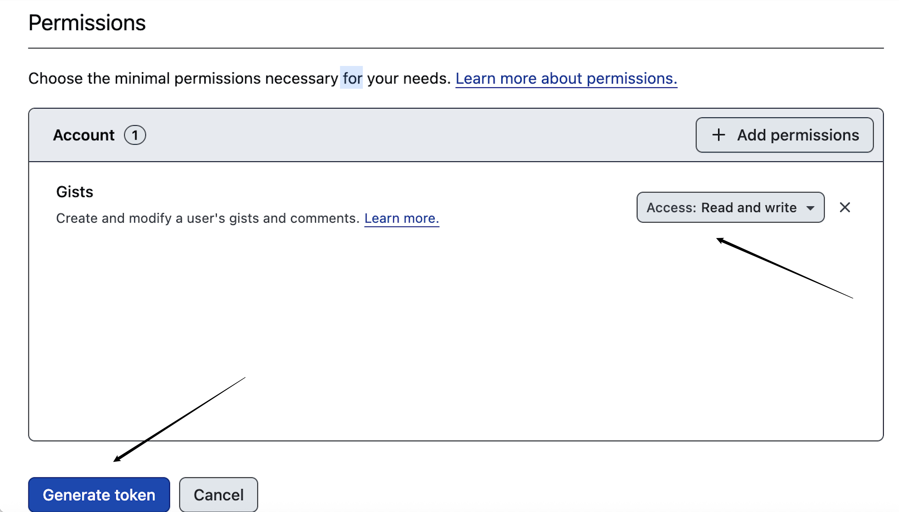

[English](./README.md) · [简体中文](./README.zh-CN.md)

# Better GitHub Stars Manager

[](https://developer.chrome.com/docs/extensions/mv3/intro/)
[](https://www.typescriptlang.org/)
[](https://github.com/izumi0uu/better-github-stars-manager/releases)
[](./LICENSE)

> A Chrome extension for people who have outgrown GitHub's native stars page — personal-first, zero-server, built for heavy GitHub stars users.



## Table of Contents

- [Why Better GitHub Stars Manager?](#why-better-github-stars-manager)
- [Features](#features)
- [Screenshots](#screenshots)
- [How to Use](#how-to-use)
- [Install](#install)
- [Privacy and Storage](#privacy-and-storage)
- [Development](#development)
- [License](#license)
- [Contributing](#contributing)

## Why Better GitHub Stars Manager?

GitHub Stars is useful for bookmarking, but weak for long-term organization.

Once your stars grow into the hundreds or thousands, the default experience starts to hurt:

- pagination slows everything down
- there is no personal tagging system
- there is no real notes layer
- it becomes hard to revisit what you saved and why

Better GitHub Stars Manager adds the missing management layer on top of GitHub Stars. It is intentionally focused — not a GitHub replacement, not a cloud-hosted bookmarking product, and it does not star/unstar repositories for you. The goal is narrower and more practical: make GitHub Stars genuinely manageable for heavy users.

## Features

- **All stars in one place**
  Load your starred repositories into a virtualized table that stays usable even with very large collections.

- **Fast search and filtering**
  Search across repository name, description, topics, and notes. Filter by language, tags, and untagged items.

- **Custom tags and notes**
  Add your own labels and notes so your stars become a working library instead of a passive list.

- **Auto-suggested tags**
  Turn repository topics and language into suggested tags with one click or in bulk.

- **Incremental sync and full rescan**
  Pull in newly starred repositories quickly, and run a full rescan when you want to reconcile unstars while keeping your annotations.

- **Repo-page tag chip**
  See and edit your tags directly on individual GitHub repository pages.

- **Cross-device annotation sync**
  Push and pull your tags and notes through your own private GitHub Gist.

- **Gist-backed storage layer**
  Keep your annotation layer in a dedicated secret Gist so it is portable, recoverable, and easy to sync across devices without a backend.

- **Local-first architecture**
  Star metadata is stored locally for speed. Your personal annotation layer can be synced without needing a custom backend.

## Screenshots

### Preview


> This preview also serves as the source for store promo images.

## How to Use

1. Install the extension in Chrome as an unpacked MV3 extension.
2. Open the Options page and paste a GitHub personal access token.
3. Visit your GitHub stars page: `https://github.com/{you}?tab=stars`.
4. Run **Sync** to import your stars.
5. Search, filter, tag, and add notes as you review repositories.
6. Use **Push** and **Pull** if you want your annotations to travel across devices.

## Install

```bash
pnpm install
pnpm build
```

Then in Chrome:

1. Open `chrome://extensions`
2. Enable **Developer mode**
3. Click **Load unpacked**
4. Select the `dist/` folder
5. Open the extension **Options** page
6. Create a GitHub token with the permissions below
7. Paste the token into Options and click **Save & verify**

### Token setup

Create a **fine-grained personal access token** and click **Generate new token**.



Use **Public repositories** for repository access.



Add **Gists: read and write** so cross-device sync can work.



Recommended GitHub token permissions:

- **Public Repositories (read)**
- **Gists (read/write)**

## Privacy and Storage

The extension is designed to keep the heavy data local and sync only the personal annotation layer.

- Star metadata is stored locally in IndexedDB.
- Lightweight config lives in `chrome.storage.local`.
- Tags, notes, and tag metadata can be stored in a dedicated secret Gist under your own GitHub account.

Push / Pull only sync your annotation layer:

- `Push` uploads tags, notes, and tag metadata to your private Gist.
- `Pull` merges the latest tags, notes, and tag metadata back into the local database.
- Star metadata itself stays local and is always reconstructed from GitHub.

There is no custom backend and no separate app account.

For a store-ready privacy statement, see [docs/privacy-policy.md](docs/privacy-policy.md).

## Development

- Build: `pnpm build`
- Test: `pnpm test`
- Package release zip: `pnpm package:extension`

For a full manual verification checklist, see [`docs/VERIFY.md`](docs/VERIFY.md).
For Chrome Web Store listing copy and reviewer notes, see [`docs/chrome-web-store-submission.md`](docs/chrome-web-store-submission.md).

## License

MIT — see [LICENSE](./LICENSE).

Copyright (c) 2026 izumi0uu.

## Contributing

Issues and PRs are welcome at [the repository](https://github.com/izumi0uu/better-github-stars-manager/issues).
